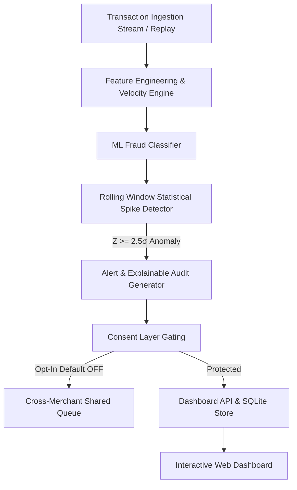

# 🛡️ Fraud-Spike Detector (RiskShield)
### Razorpay AI Buildathon — Track 02: AI Risk Manager

An explainable, defense-only fraud-spike detection system that monitors a merchant's transaction stream in real-time, identifies statistically abnormal risk surges ($+2.5\sigma$ z-score), and provides transparent decision explanations, counterfactual guidance, and strict opt-in consent controls for cross-merchant intelligence.

---

## 🌟 Key Highlights & Design Principles

1. **Mandatory Explainability**: Every flagged alert includes a plain-language audit trail, feature contribution weights (Tree-path attribution), and counterfactual guidance ("What would have prevented this alert?").
2. **Opt-in Consent Governance**: Gated signal sharing defaults to **OFF** (`Isolated`). Single-merchant protection is guaranteed at 100% capacity regardless of consent status.
3. **Honest Time-Based Evaluation**: Models are evaluated on chronological train/test splits (no lookahead bias), transparently reporting Precision, Recall, False-Positive Rate, and Estimated False-Positive Dollar Cost vs black-box marketing claims.
4. **Strictly Defense-Only**: Engineered solely for defensive risk monitoring; no offensive or probing vectors.

---

## 🏗️ Architecture & Component Flow



- **Feature Engineering** (`backend/classifier.py`): Computes transaction ticket deviation from merchant average, device velocity (15m window), IP concentration (1h window), and off-hours risk flags.
- **ML Classifier** (`backend/classifier.py`): Random Forest classifier generating calibrated probability $P(\text{fraud})$ and feature attribution scores.
- **Spike Detector** (`backend/spike_detector.py`): In-memory rolling-window buffer per merchant tracking short-term fraud rates against a moving baseline.
- **Consent Governance** (`backend/consent.py`): Enforces opt-in policies with immutable audit logging.
- **Evaluation Harness** (`backend/eval_harness.py`): Evaluates generalization across temporal boundaries and calculates operational investigation costs.
- **Stream Simulator** (`backend/simulator.py`): Stand-in for real-time live ingestion feeds with play/pause, single-step, and coordinated attack burst injection.

---

## 🖥️ User Interface (4 Dedicated Screens)

1. **Dashboard Summary**: Real-time fraud rates, $+2.5\sigma$ threshold canvas chart, live transaction ingestion ticker, and recent alerts.
2. **Alert Detail & Audit Trail**: Visual feature contribution bars, raw window statistics, and plain-English counterfactual explanations.
3. **Consent Controls**: Opt-in toggle with protection guarantees and full history logs.
4. **Time-Split Metrics**: Verified generalization metrics, false-positive dollar cost, and comparative benchmarks.

---

## 🚀 Quickstart Guide

### 1. Install Dependencies
```bash
pip install -r requirements.txt
```

### 2. Run Test Suite
```bash
python -m pytest -v tests/
```

### 3. Start the Server
```bash
uvicorn backend.app:app --host 127.0.0.1 --port 8000 --reload
```

Open **`http://127.0.0.1:8000`** in your browser to view the interactive dashboard.

---

## 📡 API Contract

| Method | Endpoint | Description |
| :--- | :--- | :--- |
| `POST` | `/ingest` | Feed a transaction into the real-time scoring and spike detection pipeline |
| `GET` | `/merchants/{id}/alerts` | List all historical alerts for a merchant (newest first) |
| `GET` | `/alerts/{id}/audit` | Human-readable explanation, feature weights, and counterfactuals |
| `GET` | `/merchants/{id}/consent` | Retrieve current consent status and audit history |
| `POST` | `/merchants/{id}/consent` | Update cross-merchant signal sharing toggle |
| `GET` | `/merchants/{id}/metrics` | Time-split evaluation metrics and false-positive cost accounting |
| `GET` | `/dashboard/summary` | Aggregate dashboard state for demo presentation |
| `POST` | `/simulator/start` | Start live transaction stream replay |
| `POST` | `/simulator/burst` | Inject high-velocity coordinated fraud burst |

---

## 📂 Project Structure

```
├── .agent/
│   ├── rules/
│   │   └── fraud_detector_invariants.md  # Architectural and safety invariants
│   └── skills/
│       └── fraud-spike-engine/SKILL.md   # Statistical spike detection guide
├── backend/
│   ├── app.py                            # FastAPI routes and static delivery
│   ├── classifier.py                     # ML model & tree-path explainability
│   ├── consent.py                        # Consent governance & audit logging
│   ├── database.py                       # SQLAlchemy models & SQLite setup
│   ├── eval_harness.py                   # Time-split evaluation harness
│   ├── schemas.py                        # Pydantic request/response schemas
│   ├── simulator.py                      # Replay stream & burst injector
│   └── spike_detector.py                 # Rolling buffer & z-score engine
├── frontend/
│   ├── app.js                            # UI state & canvas chart renderer
│   ├── index.html                        # Dashboard layout (4 screens)
│   └── style.css                         # Dark fintech styling
├── tests/
│   └── test_system.py                    # Unit and integration test suite
├── .gitignore                            # Excludes db, plan, caches, secrets
├── README.md                             # Documentation & user guide
└── requirements.txt                      # Python dependencies
```

---

## ⚖️ License
MIT License
